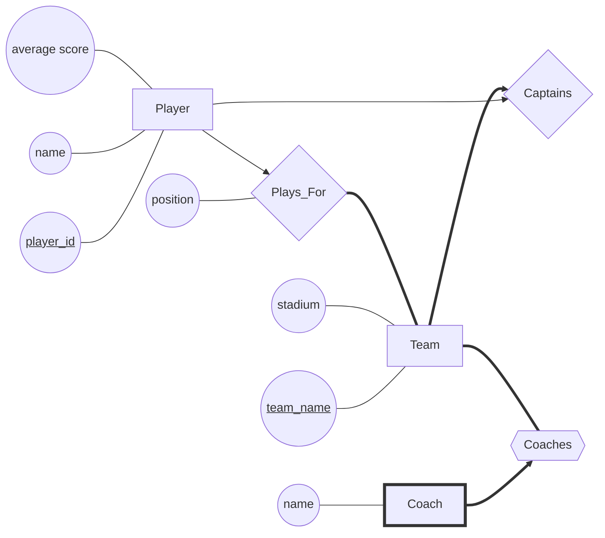

# DIS 10

## 1 ERDiagrams

Wewant to store sports teams and their players in our database. Draw an ER diagram correspond ing to data given below: 

- Every Team in our database will have a unique team_name and a stadium where they play their games. 
- Each Coach has a name. 
- Each Player will have a unique player_id, a name and an average score. 
- Our database will contain who Plays_For which team and also the “position” that the player plays in. We also need to store who Captains a team, and who Coaches a team. 
- Every Team needs players, and needs exactly one captain. 
- Each Player can be on at most one team, but may currently be a free agent and not on any team. 
- Each team needs coaches and may have many. 
- ACoach is uniquely identified by which team they coach.

## 2 Functional Dependencies

1. Consider a set of functional dependencies F = {X-> Y, Y-> Z}. For each of the following symbols or expressions, indicate whether it is (a) an attribute, (b) a set of attributes, (c), a set of sets of attributes, (d) a functional dependency, (e) a set of functional dependencies, or (f) none of the above. 

   (a) X  **a** 错误：b

   (b) XY  **b**

   (c) X-> Y **d**

   (d) F **b** 错误：e

   (e) F+ **e**

   (f) X+ **e** 错误：b

   (g) Armstrong’s reflexivity axiom **f**

   

2. Consider a relation R(x, y, z) and the list of functional dependencies X-> Y, XY-> YZ, and Y-> Xwhere X = {x}, Y = {y}, and Z = {z}. For each of the following relations, indicate which functional dependencies it might satisfy.

   **表一均不满足**

   **表二可能满足XY-> YZ**

   **表三可能满足X-> Y，XY-> YZ**

   **表四可能满足X-> Y，XY-> YZ，Y-> X**

3. Consider the set F = {A-> B, AB-> AC, BC-> BD, DA-> C} of functional dependencies. Compute the following attribute closures.

   (a) A+ **{A, B, C, D}**

   (b) B+, C+, D+ **{B}, {C}, {D}**

   (c) AB+, AC+, AD+ **{A, B, C, D}, {A, B, C, D}, {A, B, C, D}**

   (d) BC+ **{B, C, D}**

   (e) BD+ **{B, D}**

   (f) CD+ **{C, D}**

   (g) BCD+ **{B, C, D}**

   

4. Consider again the set F of functional dependencies from Question 3. Indicate whether the following sets of attributes are candidate keys, superkeys (but not candidate keys), or neither.

   (a) A **superkey** 错误：candidate key

   (b) B, C, D **all neither**

   (c) AB, AC, AD **all superkeys**

   (d) BC **neither**

   (e) BD **neither**

   (f) CD **neither**

   (g) BCD **neither**

​	

## 3 Normal Forms

1. Decompose R = ABCDEFG into BCNF, given the functional dependency set: F = AB → CD, C→EF,G→A,G→F,CE→F

   **{A, B, C, D}, {C, E, F}, {A, G}, {B, G}**