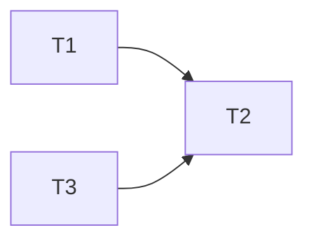
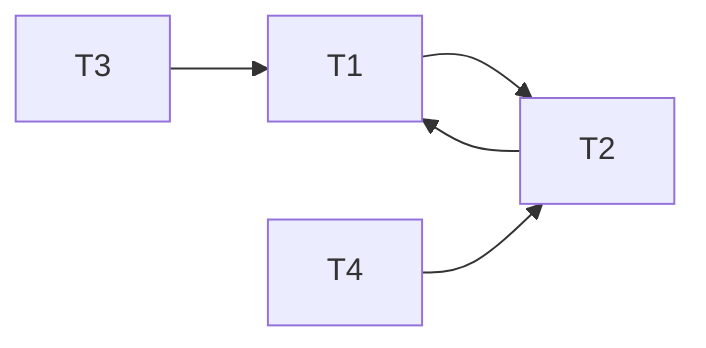
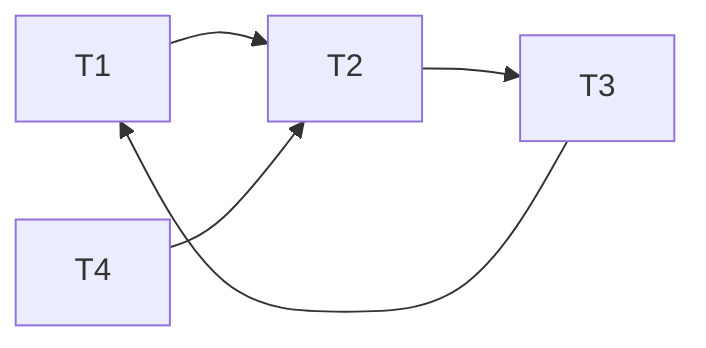

# DIS 8

## 1 Conflict Serializability

 (a) Draw the dependency graph (precedence graph) for the schedule. 

 (b) Is this schedule conflict serializable? If so, what are all the conflict equivalent serial schedules? If not, why not?

**是的，包括t1->t3->t2以及t3->t1->t2。**

 (c) Draw the dependency graph (precedence graph) for the schedule. 

 (d) Is this schedule conflict serializable? If so, what are all the conflict equivalent serial schedules? If not, why not?

**不是，因为依赖图中成环了。**

##  2 Deadlock

(a) Draw a "waits-for" graph and state whether or not there is a deadlock. 

**存在死锁**

(b) If we try to avoid deadlock by using the wait-die deadlock avoidance policy, would any trans actions be aborted? Assume T1 priority > T2 > T3 > T4.

**T3, T4**

## 3 Locking

(a) What is printed, assuming we initially have B = 3 and F = 300? 

**3030**

(b) Does the execution use 2PL or strict 2PL? 

**均不满足**

(c) Would moving Unlock(F) in the second transaction to any point after Lock_S(B) change this (or keep it) in 2PL? 

**移动后满足2PL**

(d) Would moving Unlock(F) in the first transaction and Unlock(F) in the second transaction to the end of their respective transactions change this (or keep it) in strict 2PL? 

**T1不满足，T2满足strict 2PL**

(e) Would moving Unlock(B) in the first transaction and Unlock(F) in the second transaction to the end of their respective transactions change this (or keep it) in strict 2PL?

**移动后均满足strict 2PL**

## 4 Multigranularity Locking

(a) Suppose a transaction T1 wants to scan a table R and update a few of its tuples. What kinds of locks should T1 have on R, the pages of R, and the updated tuples?

**R: SIX, the pages of R: IX, and the updated tuples: X**

(b) Is an S lock compatible with an IX lock?

**不兼容**

(c) Consider a table which contains two pages with three tuples each, with Page 1 containing Tuples 1, 2, and 3, and Page 2 containing Tuples 4, 5, and 6.

​	(a) Given that a transaction T1 has an IX lock on the table, an IX lock on Page 1, and an X lock on Tuple 1, which locks could be granted to a second transaction T2 for Tuple 2?

​	**S AND X**

​	(b) Given that a transaction T1 has an IS lock on the table and an S lock on Page 1, what locks could be granted to a second transaction T2 for Page 1?

​	 **IS AND S**

## 5 Project Prep

The LockManager in the project will have the following 4 functions:
	• acquire(transaction, resourceName, lockType): this method is the stan-
dard acquire method of a lock manager. It allows a transaction to request one lock, and
grants the request if there is no queue and the request is compatible with existing locks.
Otherwise, it should queue the request (at the back) and block the transaction
	• release(transaction, resourceName): this method is the standard release method
of a lock manager. It allows a transaction to release one lock that it holds.
	• acquireAndRelease(transaction, resourceName, lockType, releaseLocks):
this method atomically acquires one lock and releases zero or more locks. This method has
priority over any queued requests (it should proceed even if there is a queue, and it is placed
in the front of the queue if it cannot proceed).
	• promote(transaction, resourceName, lockType): this method allows a trans-
action to explicitly promote/upgrade a held lock. This method has priority over any queued requests (it should proceed even if there is a queue, and it is placed in the front of the queue if it cannot proceed).

​	In this problem we will have 3 transactions (T1, T2, T3) and 2 resources that we will try to lock (A, B). After each lock request is processed, fill out the following two tables that store the information for what locks are held:

The following lock requests are made in this order:
• acquire(T1, A, X)

**T1: A(X), T2:	, T3:**	

• acquire(T2, B, S)

**T1: A(X), T2: B(S), T3:**	

• acquire(T3, B, X)

**T1: A(X), T2: B(S), T3:**	

• acquireAndRelease(T2, A, S, releaseLocks=<B>)

**T1: A(X), T2: B(S), T3:**	

• release(T1, A)

**T1: 	, T2: A(S), T3: B(X)**

• acquire(T1, A, S)

**T1: A(S), T2: A(S), T3: B(X)**

• acquire(T3, A, X)

**T1: A(S), T2: A(S), T3: B(X)**

• promote(T2, A, X)

**T1: A(S), T2: A(S), T3: B(X)**

• release(T1, A)

**T1:	, T2: A(X), T3: B(X)**