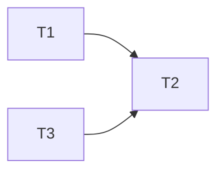
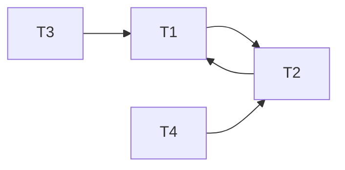
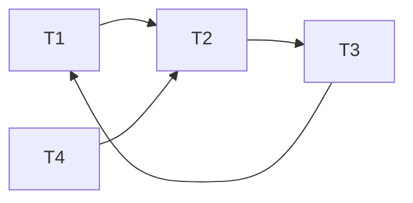

# DIS 8

## 1 Conflict Serializability

 (a) Draw the dependency graph (precedence graph) for the schedule. 

 (b) Is this schedule conflict serializable? If so, what are all the conflict equivalent serial schedules? If not, why not?

**是的，包括t1->t3->t2以及t3->t1->t2。**

 (c) Draw the dependency graph (precedence graph) for the schedule. 

 (d) Is this schedule conflict serializable? If so, what are all the conflict equivalent serial schedules? If not, why not?

**不是，因为依赖图中成环了。**

##  2 Deadlock

(a) Draw a "waits-for" graph and state whether or not there is a deadlock. 

**存在死锁**

(b) If we try to avoid deadlock by using the wait-die deadlock avoidance policy, would any trans actions be aborted? Assume T1 priority > T2 > T3 > T4.

**T3, T4**

## 3 Locking

(a) What is printed, assuming we initially have B = 3 and F = 300? 

**3030**

(b) Does the execution use 2PL or strict 2PL? 

**均不满足**

(c) Would moving Unlock(F) in the second transaction to any point after Lock_S(B) change this (or keep it) in 2PL? 

(d) Would moving Unlock(F) in the first transaction and Unlock(F) in the second transaction to the end of their respective transactions change this (or keep it) in strict 2PL? 

(e) Would moving Unlock(B) in the first transaction and Unlock(F) in the second transaction to the end of their respective transactions change this (or keep it) in strict 2PL?